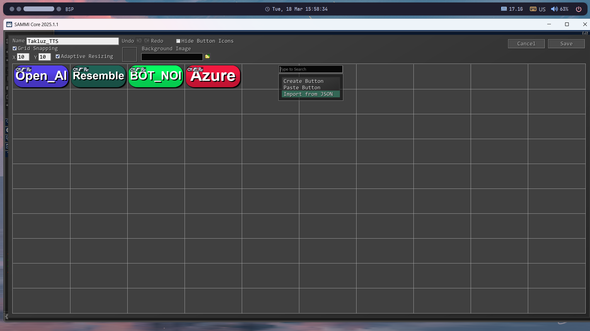
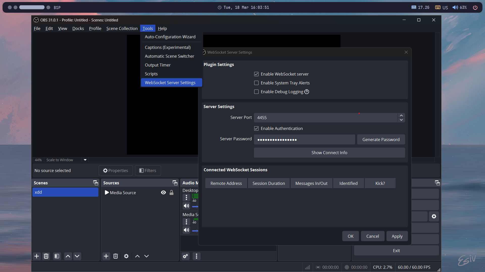

# Takluz_TTS

Takluz_TTS is a text-to-speech (TTS) project that converts written text into spoken words. It is designed to provide high-quality, natural-sounding speech synthesis.

## Application examples
* **TURN ON AUDIO FIRST**

https://github.com/user-attachments/assets/a13dec69-70a5-4600-8870-987a531c1613

Full Clip [Here](https://www.twitch.tv/takluz/clip/FaintMiniatureTrayWow-TYVUjG5PHFksa8i0)

https://github.com/user-attachments/assets/3f445c20-90ca-4086-b9a4-b0148171c0b2

Full Clip [Here](https://www.twitch.tv/takluz/clip/CorrectEvilButterPogChamp-PmfPRK0Lz6-wpMai)

https://github.com/user-attachments/assets/54fcacc3-e1c5-4de3-a242-0351ea7c62f9

Full Clip [Here](https://www.twitch.tv/videos/2404580110?t=1h44m5s)

## Usage

**1. Prerequisites:**

*   **SAMMI Core:** Download and install the latest version of SAMMI Core from the official website.  SAMMI is the core application that will handle the connection between Twitch, your TTS engine, and OBS Studio.
*   **OBS Studio:** Ensure you have OBS Studio installed and configured for streaming.
*  **A Twitch account:** obviously you will need an account.
*   **A TTS Engine Account:** You'll need an account and API key/credentials for your chosen TTS engine (OpenAI, Azure, Botnoi, or Resemble AI).  Each engine has its own setup process. See "Supported TTS Engines" below for more details.

**2. SAMMI Setup:**

*   **Connect SAMMI to Twitch:**
    *   Open SAMMI Core.
    *   Follow the on-screen instructions or SAMMI's documentation to connect your Twitch account.  This usually involves authorizing SAMMI to access your Twitch account.

*   **Create a New Deck:**
    *   In SAMMI, create a new deck.  A deck is essentially a collection of buttons and commands.  You can name it something like "Takluz_TTS".

*   **Import Takluz_TTS Buttons:**
    *   **Locate the JSON file:** Find the appropriate JSON file within the  that corresponds to your chosen TTS engine (OpenAI, Azure, Botnoi, or Resemble AI). These JSON files contain pre-configured button layouts and commands.
    *   **Import:** In SAMMI, within your new deck, right-click on an empty area and select "Import JSON".  Paste the contents of the JSON file you copied from the repository. This will create the necessary buttons for controlling Takluz_TTS.
    *   

**3. Configure Takluz_TTS Settings (setting.exe):**

*   **Open `setting.exe`:**  Locate and run the `setting.exe` file provided with Takluz_TTS. This application allows you to configure the connection to your chosen TTS engine and OBS.

*   **TTS Engine Configuration:**
    *   In `setting.exe`, find the button corresponding to your preferred TTS engine (e.g., "OpenAI", "Azure").
    *   Click the button.
    *   A field will appear where you should paste your API key, secret key, or other required credentials for that specific TTS engine.  Make sure you have obtained these credentials from the TTS provider's website.

**4. OBS Studio Integration:**

*   **Enable WebSocket Server:**
    *   In OBS Studio, go to "Tools" in the menu bar.
    *   Select "WebSockets Server Settings".
    *   Make sure the "Enable WebSockets server" checkbox is checked.  You may need to install the OBS Websocket plugin if it's not already installed.
* **Get the Server Password:**
    * In the same "WebSockets Server Settings" window, click the "Show Connect Info" button.
    * Copy the "Server Password" from this dialog.
     

*  **Configure OBS in `setting.exe`:**
   *   Return to `setting.exe`.
   *   Click the "OBS" button.
   *   Paste the OBS WebSocket server password you copied into the provided field.

**5. Start Takluz_TTS:**

*   **Run `takluz_tts.exe`:** Locate and run the `takluz_tts.exe` file. This is the main application that handles the text-to-speech processing.

**6. Using Takluz_TTS in your Stream:**

*   Now, when a configured trigger occurs on your Twitch stream (e.g., a chat command, a channel point redemption – as defined in the SAMMI buttons), Takluz_TTS will:
    1.  Receive the text from SAMMI.
    2.  Send the text to your chosen TTS engine.
    3.  Receive the synthesized audio.
    4.  Play the audio through your configured audio output (which should be captured by OBS).

**Supported TTS Engines:**

Takluz_TTS supports the following TTS engines.  You will need to obtain API keys/credentials from each provider separately:

*   **OpenAI:** Requires an OpenAI API key. You'll likely use the `tts-1` or `tts-1-hd` models. Refer to OpenAI's documentation for pricing and usage.
*   **Azure:** Requires an Azure Speech service key and region.  Refer to Azure's documentation for setup and configuration.
*   **Botnoi:**  Requires a Botnoi API key. Refer to Botnoi's documentation.
*   **Resemble AI:** Requires a Resemble AI API key. Refer to Resemble AI's documentation.

**Troubleshooting:**

*   **No Audio:** Double-check your audio output settings in both `setting.exe` and OBS Studio. Make sure the correct audio device is selected.  Ensure the volume is turned up.
*   **SAMMI Not Connecting:** Verify your Twitch connection in SAMMI.  Ensure you've authorized SAMMI correctly.
*   **OBS Not Connecting:**  Confirm that the OBS WebSocket server is enabled and that you've entered the correct password in `setting.exe`.  Ensure the OBS Websocket plugin is installed and up-to-date.
*   **TTS Engine Errors:** Check the error messages from Takluz_TTS and consult the documentation for your specific TTS engine.  Common issues include incorrect API keys, exceeding usage limits, or network connectivity problems.
* **JSON import Error:** Make sure the selected TTS engine from setting.exe matches the TTS Engine from the downloaded JSON.

**Important Considerations:**

*   **API Keys:** Keep your API keys secret.  Do not share them publicly.
*   **Usage Costs:** Be aware of the pricing and usage limits for your chosen TTS engine.  Some engines have free tiers, but exceeding those limits may incur costs.
*   **Latency:** There may be a slight delay between the trigger and the audio playback, depending on your internet connection and the TTS engine's processing time.
* **Ensure run as Admin** Run all related apps as an administrator can sometimes resolve the problem.

## Contact

Since the installation process can be complex, you can join our Discord for guided assistance.
[Discord](https://discord.gg/whnxWt4NKj)
